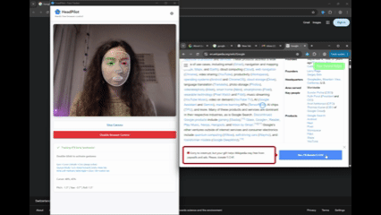

# HeadPilot



**Hands-free browser control using face tracking and gestures**

HeadPilot is a Chrome browser extension that enables completely hands-free web browsing through facial recognition, head movements, and voice commands. Control your browser with natural head gestures, eye gaze, and speech recognition.

---

## Purpose and Functionality

### Core Features

**1. Face Tracking & Gesture Control**
- Real-time face detection using [MediaPipe](https://ai.google.dev/edge/mediapipe/solutions/vision/face_landmarker)
- Head gesture recognition (tilt, pitch, yaw, roll)
- Facial expression detection (smile, wink, jaw open, eyebrow raise)
- Configurable gesture thresholds and sensitivity settings

**2. Hands-Free Navigation**
- **Head Gestures:**
  - Double blink: activate gesture mode
  - Tilt left/right: Navigate between tabs
  - Sharp turn left/right: Browser back/forward navigation
  - Look up/down: Scroll pages
  - Jaw open (hold): Click elements
  - Smile (hold): Open new tab or confirm actions
  - Wink Left (hold): Close tab
  - Wink Right (hold): Refresh page
  - Eyebrow raise: Activate writing mode

- **Eye Gaze Cursor:**
  - Virtual cursor controlled by eye gaze position
  - Smooth cursor tracking with configurable speed
  - Click at cursor position with jaw open gesture

**3. Text Field Mode**
- Automatic text field detection on web pages
- Navigate between text fields using head tilts
- Select fields by holding position
- Speech-to-text dictation for hands-free typing
- AI-powered text editing with [Chrome's built-in AI APIs](https://developer.chrome.com/docs/ai/built-in-apis):
  - **Keep**: Use text as-is
  - **Fix**: Grammar and spelling correction
  - **Rewrite**: Enhance and refine text

**4. Browser Control**
- Scroll web pages
- Click links and buttons
- Navigate browser history
- Open/close tabs
- Switch between tabs
- Refresh pages

**5. Visual Feedback**
- Real-time gesture feedback overlay
- Text field highlights with numbered labels
- Speech recognition status indicator
- Mode indicators (Neutral, Gesture Active, Text Field)
- Notification system for actions and confirmations

---

## Repository Structure

```
headpilot-extension/
├── manifest.json                 # Chrome extension manifest (MV3)
├── config.js                     # Centralized configuration and thresholds
├── icons.js                      # SVG icon definitions
│
├── background.js                 # Service worker for extension
├── content.js                    # Content script injected into web pages
├── offscreen.js                  # Offscreen document for Chrome AI APIs
├── offscreen.html                # Offscreen document HTML
│
├── popup.html                    # Extension popup UI
├── popup.js                      # Popup logic
│
├── tracker.html                  # Face tracking window UI
├── tracker.js                    # Face tracking and gesture detection
├── tracker.css                   # Tracker window styles
│
├── content-styles.css            # Styles for content script overlays
├── gesture-config.js             # Dynamic gesture configuration manager
│
├── vision_bundle.mjs             # MediaPipe Vision library bundle
├── wasm/
│   ├── vision_wasm_internal.js   # WASM JavaScript interface
│   └── vision_wasm_internal.wasm # WASM binary for face detection
│
└── headpilot_logo.png            # Extension icon
```

### Key Components

**Core Files**
- `manifest.json`: Extension configuration with permissions and resources
- `config.js`: All configuration constants, thresholds, and sensitivity settings
- `icons.js`: Material Design-style SVG icons for UI

**Extension Scripts**
- `background.js`: Service worker handling message routing, tab management, and AI API coordination
- `content.js`: Injected into web pages for direct DOM interaction, cursor control, and text field detection
- `offscreen.js`: Isolated context for Chrome AI APIs

**User Interface**
- `popup.html/js`: Simple launcher that opens the tracker window
- `tracker.html/js`: Main control window with live video feed, gesture detection, and settings panel
- `content-styles.css`: Styles for on-page overlays (cursor, highlights, notifications)

**Face Tracking**
- `vision_bundle.mjs`: MediaPipe FaceLandmarker library
- `wasm/`: WebAssembly binaries for high-performance face detection
- `gesture-config.js`: Adaptive gesture configuration based on user fatigue and context

---

## How to Load and Get Started

### Prerequisites

- **Chrome Browser**
- **Webcam** with front-facing camera access
- **Microphone** (optional, for speech-to-text features)
- **Chrome AI APIs** (optional, for text editing features)

### Installation

1. **Clone or Download the Repository**
   ```bash
   git clone <repository-url>
   cd headpilot-extension
   ```

2. **Load the Extension in Chrome**
   - Open Chrome and navigate to `chrome://extensions/`
   - Enable **Developer mode** (toggle in top-right corner)
   - Click **Load unpacked**
   - Select the `headpilot-extension` folder
   - The extension icon should appear in your toolbar

3. **Grant Permissions**
   - When first activated, Chrome will request:
     - Camera access (required for face tracking)
     - Microphone access (required for speech-to-text)
   - Click "Allow" for both permissions

### Getting Started

1. **Open the Tracker Window**
   - Click the HeadPilot extension icon in your toolbar
   - Click the "Open HeadPilot Tracker" button
   - A new window will open with your webcam feed

2. **Calibrate (First Use)**
   - Position yourself comfortably in front of your webcam
   - Keep your head in a neutral position
   - The extension will auto-calibrate your neutral head position (3 seconds)

3. **Enable Browser Control**
   - In the tracker window, click "Enable Browser Control"
   - Face tracking will activate and inject control scripts into all open tabs
   - Green indicator "Face Control Active" appears on web pages

4. **Activate Gesture Mode**
   - Double blink to activate gesture recognition
   - Visual feedback will indicate "Gesture Mode Active" (lasts 5 seconds)
   - Perform gestures to control the browser

5. **Use Text Field Mode**
   - Raise your eyebrows to "Enable Text Field Mode"
   - All text fields on the page will be highlighted with numbers
   - Tilt head left/right to navigate between fields
   - Hold position for 2 seconds to select a field
   - Speak to dictate text
   - After 3 seconds of silence, choose: Keep, Fix, or Rewrite

### Gesture Quick Reference

| Gesture | Action | Hold Time |
|---------|--------|-----------|
| Double blink | Activate gesture mode | - |
| Eyebrow raise | Activate writing mode | - |
| Tilt left/right | Navigate elements/fields | - |
| Look up/down | Scroll page | - |
| Sharp turn left | Browser back | - |
| Sharp turn right | Browser forward | - |
| Jaw open | Click / Select | 500ms |
| Smile | New tab / Confirm | 1500ms |
| Left wink | Close tab | 1000ms |
| Right wink | Refresh page | 1000ms |

---

## Configuration

### Sensitivity Settings

Adjust sensitivity in the tracker window settings panel:

- **Scroll Sensitivity**: 10-200% (default: 100%)
- **Click Sensitivity**: 50-200% (default: 100%)
- **Gesture Sensitivity**: 50-200% (default: 100%)
- **Cursor Speed**: 25-200% (default: 100%)

### Advanced Configuration

Edit `config.js` to customize:

- Gesture thresholds (degrees, blend shape scores)
- Hold times for gestures
- Cooldown periods between actions
- Scroll speed and dead zones
- Text field mode timings
- Video and MediaPipe settings

### Trial Tokens (Optional)

For Chrome AI API features, add a trial token in `manifest.json`:
```json
"trial_tokens": [
  "your_trial_token_here"
]
```

---

## Development

### Debug Mode

Enable debug logging by setting `DEBUG = true` in any of these files:
- `background.js`
- `content.js`
- `tracker.js`
- `config.js`

### File Modifications

When making changes:
- After editing code, reload the extension in `chrome://extensions/`
- Click the refresh icon on the HeadPilot extension card
- Close and reopen the tracker window to see changes
